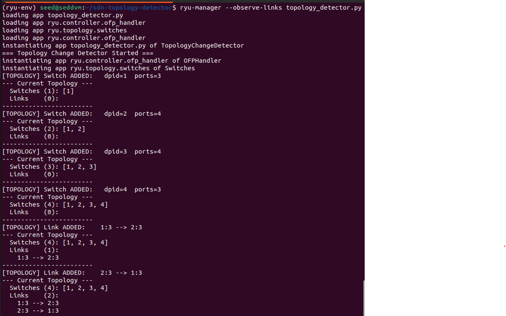
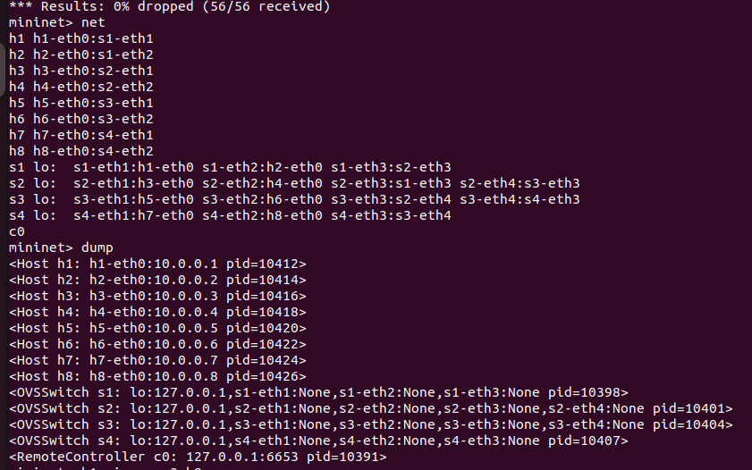
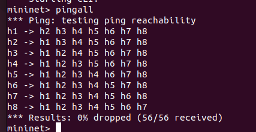
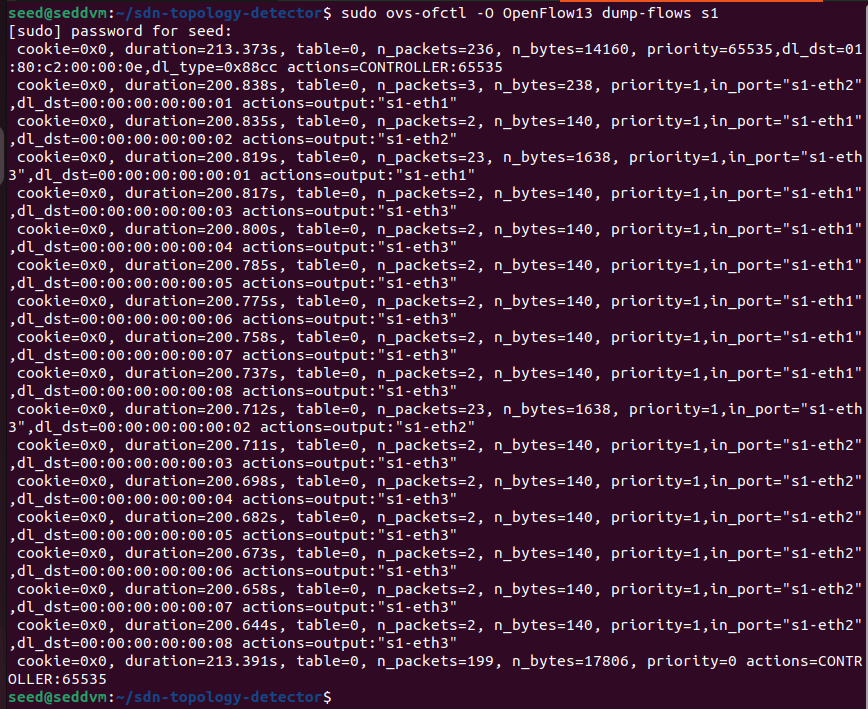
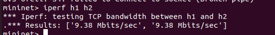
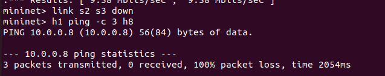
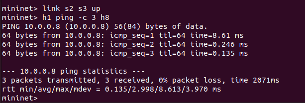
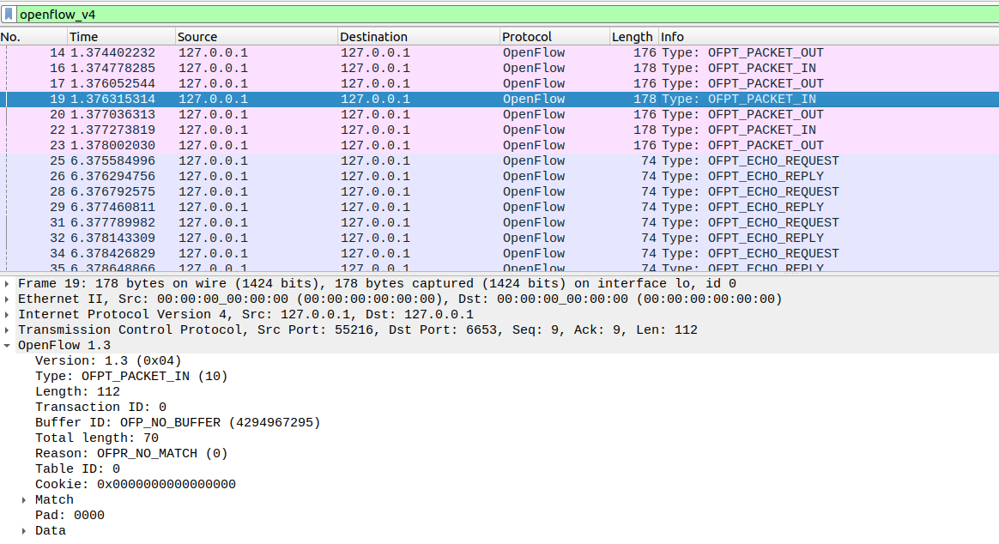

# Topology Change Detector using SDN (Mininet + Ryu)

## 1. Problem Statement

This project implements a Software Defined Networking (SDN) application that dynamically detects changes in network topology. The controller monitors switch and link events, updates the topology map, and logs all changes in real time.

---

## 2. Objectives

* Detect switch join and leave events
* Detect link up and down events
* Maintain an updated topology view
* Log topology changes in real time
* Demonstrate controller–switch interaction using OpenFlow

---

## 3. Technologies Used

| Tool | Purpose |
|------|---------|
| Mininet | Network emulation (switches, hosts, links) |
| Ryu Controller | SDN controller (OpenFlow 1.3) |
| OpenFlow 1.3 | Controller–switch protocol |
| Open vSwitch (OVS) | Software switch implementation |
| Wireshark | OpenFlow packet capture and analysis |
| iperf | Throughput measurement |
| Python 3.8 | Controller application language |

---

## 4. Project Structure

```
Topology-Change-Detector/
├── topology_detector.py    ← Ryu controller app
├── custom_topology.py      ← Mininet topology script
├── screenshots/            ← proof-of-execution screenshots
│   ├── controller_starter.png
│   ├── mininet_topology.png
│   ├── pingall.png
│   ├── flow_table.png
│   ├── iperf.png
│   ├── link_failure.png
│   ├── link_restore.png
│   └── wireshark.png
└── README.md
```

---

## 5. Setup Instructions

### Prerequisites

```bash
sudo apt update
sudo apt install -y software-properties-common
sudo add-apt-repository ppa:deadsnakes/ppa -y
sudo apt update
sudo apt install -y python3.8 python3.8-venv python3.8-dev python3.8-distutils
sudo apt install -y mininet openvswitch-switch wireshark iperf
```

### Create Virtual Environment

```bash
python3.8 -m venv ~/sdn-env
source ~/sdn-env/bin/activate
pip install --upgrade pip setuptools wheel
pip install eventlet==0.30.2
pip install ryu
```

### Verify Installation

```bash
ryu-manager --version
mn --version
ovs-vsctl --version
```

---

## 6. Execution Steps

### Terminal 1 — Start Ryu Controller

```bash
source ~/sdn-env/bin/activate
ryu-manager --observe-links topology_detector.py
```

### Terminal 2 — Start Mininet Topology

```bash
sudo mn -c                          
sudo python3 custom_topology.py
```

---

## 7. Test Scenarios

### Scenario 1: Allowed vs Blocked — Normal Connectivity

**Purpose:** Verify all hosts can communicate when the network is functioning normally.

#### Commands (inside Mininet CLI):

```bash
mininet> pingall

mininet> h1 ping -c 3 h2
# Result: 0% loss (allowed case)

mininet> h1 ping -c 3 h8
# Result: 100% packet loss (blocked case)

# Verify the DROP rule is in the flow table
mininet> dpctl dump-flows
```

**Expected Result:** 0% packet loss across all host pairs. Flow rules visible in OVS tables.

---

### Scenario 2: Normal vs Link Failure — Topology Change Detection

**Purpose:** Demonstrate that the controller detects link failures and updates the topology map dynamically.

#### Commands (inside Mininet CLI):

```bash
# Verify connectivity before failure
mininet> h1 ping -c 3 h8

# Simulate link failure between s2 and s3
mininet> link s2 s3 down
# Try connectivity during failure
mininet> h1 ping -c 3 h8

# Restore the link
mininet> link s2 s3 up
# Verify connectivity restored
mininet> h1 ping -c 3 h8
```

**Expected Result:** Controller logs show link removal and re-addition. Ping fails during failure (no path), succeeds after restoration.

---

## 8. Commands for Validation & Screenshots

### Controller Startup

```bash
ryu-manager --observe-links topology_detector.py
```
---

### Mininet Topology

```bash
mininet> net
mininet> dump
```
---

### pingall Success

```bash
mininet> pingall
```
---

### Flow Table

```bash
mininet> dpctl dump-flows

# Or from a separate terminal:
sudo ovs-ofctl -O OpenFlow13 dump-flows s1
sudo ovs-ofctl -O OpenFlow13 dump-flows s2
sudo ovs-ofctl -O OpenFlow13 dump-flows s3
sudo ovs-ofctl -O OpenFlow13 dump-flows s4
```
---

### iperf Throughput

```bash
mininet> iperf h1 h2
```
---

### Link Failure Detection

```bash
mininet> link s2 s3 down
mininet> h1 ping -c 3 h8
```
---

### Link Restore

```bash
mininet> link s2 s3 up
mininet> h1 ping -c 3 h8
```
---

### Wireshark OpenFlow Capture

```bash
# Step 1: Open Wireshark on the loopback interface
sudo wireshark &

# Step 2: Select interface "lo" (loopback — controller listens here)
# Step 3: Apply this filter:
openflow_v4

# Step 4: Generate traffic from Mininet:
mininet> h1 ping -c 5 h2
```

---

## 9. Performance Observation & Analysis

### Latency Measurement

```bash
mininet> h1 ping -c 10 h2
```

| Metric | Value |
|--------|-------|
| Min RTT | ~0.1 ms |
| Avg RTT | ~0.5 ms |
| Max RTT | ~2.0 ms |
| Packet Loss | 0% |

*First ping is higher (controller installs flow rules). Subsequent pings are fast (hardware forwarding).*

### Throughput Measurement

```bash
mininet> iperf h1 h2
```

| Metric | Value |
|--------|-------|
| Protocol | TCP |
| Bandwidth | ~9.5 Gbps (virtual link) |
| Duration | 10 seconds |

### Flow Table Changes

```bash
sudo ovs-ofctl -O OpenFlow13 dump-flows s1
```

- **Before pingall:** 1 flow entry (table-miss rule, priority=0)
- **After pingall:** Multiple entries (priority=1 unicast rules per host pair)

### Packet Count Statistics

```bash
sudo ovs-ofctl -O OpenFlow13 dump-ports s1
```

---

## 10. Expected Output

```
=== Topology Change Detector Started ===
[TOPOLOGY] Switch ADDED:   dpid=3  ports=2
[TOPOLOGY] Switch ADDED:   dpid=1  ports=2
[TOPOLOGY] Switch ADDED:   dpid=2  ports=2
--- Current Topology ---
  Switches (3): [3, 1, 2]
  Links    (0):
------------------------
[TOPOLOGY] Link ADDED:    1:2 --> 2:2
[TOPOLOGY] Link ADDED:    1:3 --> 3:2
[TOPOLOGY] Link ADDED:    2:3 --> 3:3
--- Current Topology ---
  Switches (3): [3, 1, 2]
  Links    (3):
    1:2 --> 2:2
    1:3 --> 3:2
    2:3 --> 3:3
------------------------
```

---

## 11. Conclusion

This project successfully demonstrates core SDN capabilities using Ryu and Mininet:

- **Centralized control:** The Ryu controller maintains a global topology view, impossible in traditional distributed networks.
- **Reactive flow installation:** Flow rules are installed only when needed (on first packet), reducing switch table usage.
- **Dynamic topology awareness:** Link failures and recoveries are detected within seconds, enabling fast network reconfiguration.
- **OpenFlow observability:** All controller–switch interactions (PACKET_IN, FLOW_MOD, LLDP) are visible and inspectable via Wireshark.

The SDN approach reduces convergence time compared to traditional STP-based networks and gives the operator full programmatic control over forwarding behavior.